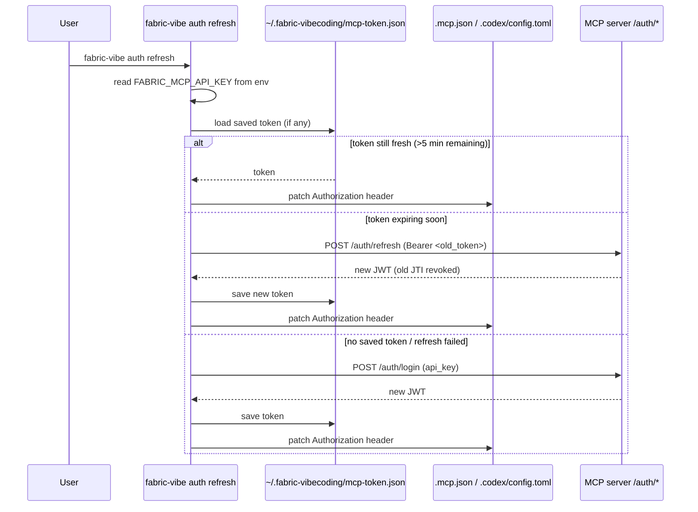
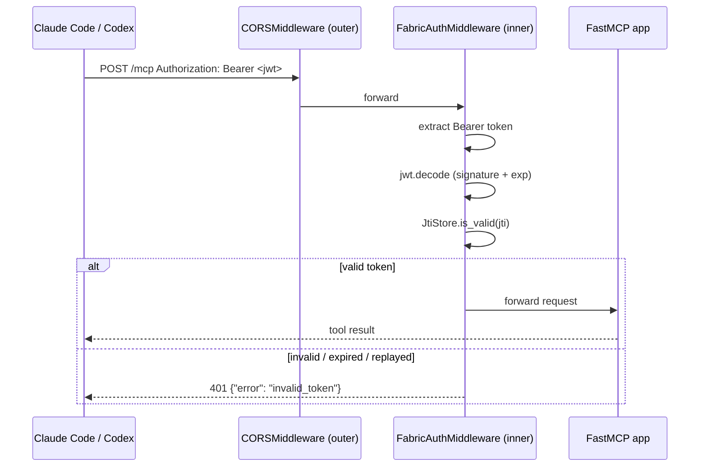

# MCP auth flow

The `fabric-server` FastMCP server uses **API-key + JWT** authentication. Auth is opt-in: if no API-key source is configured (the default `file` source with no `FABRIC_MCP_API_KEYS_FILE`, and an empty `FABRIC_MCP_API_KEYS`), the server accepts unauthenticated requests (local single-user dev mode). The whole auth layer lives under `server/auth/` (`repository.py` key sourcing, `tokens.py` JWT, `middleware.py` ASGI middleware); `server/app.py` only wires it on.

## Overview

```
Client (user's laptop)                   Server (Docker 127.0.0.1:8000)
─────────────────────                    ───────────────────────────────
FABRIC_MCP_API_KEY                       config/api-keys.csv
  (from shell profile)                     (admin-managed email,apikey CSV)
        │                                        │
        ▼                                        ▼
POST /auth/login ──{"api_key": "..."} ──► validate key
        ◄── {"token": "<jwt>", ...} ─────── mint JWT (1 h, signed HS256)
        │                                   JtiStore: record jti
        ▼
Bearer <jwt> injected into
  .mcp.json + .codex/config.toml
        │
        ▼
MCP request ──► FabricAuthMiddleware
                  verify signature
                  check exp (PyJWT)
                  check jti in JtiStore
                        ▼
                  tool executed
```

## Token lifecycle

| Step | Client | Server |
|---|---|---|
| **Login** | POST `/auth/login` with `{"api_key": "..."}` | Validates key, mints JWT, records jti |
| **Request** | `Authorization: Bearer <jwt>` | Checks signature, `exp`, jti in JtiStore |
| **Refresh** | POST `/auth/refresh` with current Bearer token | Revokes old jti, mints new JWT |
| **Expiry** | Automatic via `fabric-vibe auth refresh` | Purges stale JTIs on next issue |

## JWT claims

```json
{
  "sub": "client",
  "jti": "<uuid4>",
  "iat": 1234567890,
  "exp": 1234571490,
  "iss": "fabric-mcp-server"
}
```

Signed with HS256 using `FABRIC_MCP_JWT_SECRET`. Expiry: **1 hour**.

## Client side — `fabric-vibe auth refresh`

Driven by `cli/tools/auth/refresh.py`. Called by `setup.sh` / `setup.ps1` at bootstrap and re-runnable at any time.



## Server side — `FabricAuthMiddleware`

Implemented in `server/auth/middleware.py` as a pure ASGI middleware wrapping the FastMCP app (JWT handling lives in `server/auth/tokens.py`). `server/app.py` wires it on via `install_auth_middleware(app)` and otherwise stays free of auth logic.



### Replay prevention

Each JWT contains a unique `jti` (UUID4). The `JtiStore` tracks all issued JTIs with their expiry timestamps:

- **Login / Refresh**: new jti added to JtiStore
- **Refresh**: old jti immediately revoked — a captured old token can no longer be replayed
- **Expiry**: stale JTIs purged lazily on the next `issue()` call
- **Forged tokens**: unknown jti → rejected even if signature were somehow valid

### Auth opt-out

Auth is **disabled entirely** when no key source is configured (the default `file` source with no `FABRIC_MCP_API_KEYS_FILE`) and `FABRIC_MCP_API_KEYS` is empty — the `FabricAuthMiddleware` is not added to the app, and `/auth/login` returns 404.

## Server configuration

### docker-compose.yml

```yaml
services:
  server:
    environment:
      MCP_SERVER_URL: ${MCP_SERVER_URL:-http://127.0.0.1:8000}
      FABRIC_MCP_API_KEYS_SOURCE: ${FABRIC_MCP_API_KEYS_SOURCE:-file}  # file | azure-blob
      FABRIC_MCP_API_KEYS_FILE: /config/api-keys.csv
      FABRIC_MCP_JWT_SECRET: ${FABRIC_MCP_JWT_SECRET}
    volumes:
      - ./config/api-keys.csv:/config/api-keys.csv:ro  # admin-managed (file source)
      - ./data:/data
    ports:
      - "127.0.0.1:8000:8000"
```

For the `azure-blob` source, drop the CSV volume mount and instead set
`FABRIC_MCP_API_KEYS_BLOB_CONTAINER`, `FABRIC_MCP_API_KEYS_BLOB_NAME`, and either
`FABRIC_MCP_API_KEYS_BLOB_CONNECTION_STRING` or `FABRIC_MCP_API_KEYS_BLOB_ACCOUNT_URL`
(see the variable table below).

### Environment variables

| Variable | Default | Purpose |
|---|---|---|
| `FABRIC_MCP_API_KEYS_SOURCE` | `file` | Where the api-keys CSV is loaded from: `file` (local disk) or `azure-blob` (Azure Blob Storage). |
| `FABRIC_MCP_API_KEYS_FILE` | _(unset)_ | **(file source)** Path to a CSV (`email,apikey` headers, one row per user). Only the `apikey` column is used for auth. Auth enabled when set. |
| `FABRIC_MCP_API_KEYS_BLOB_CONTAINER` | _(unset)_ | **(azure-blob source)** Blob container holding the CSV. Required. |
| `FABRIC_MCP_API_KEYS_BLOB_NAME` | _(unset)_ | **(azure-blob source)** Blob name of the CSV, e.g. `api-keys.csv`. Required. |
| `FABRIC_MCP_API_KEYS_BLOB_CONNECTION_STRING` | _(unset)_ | **(azure-blob source)** Storage-account connection string. Use this **or** the account URL. |
| `FABRIC_MCP_API_KEYS_BLOB_ACCOUNT_URL` | _(unset)_ | **(azure-blob source)** Account URL, e.g. `https://acct.blob.core.windows.net`. Authenticates with `DefaultAzureCredential` (managed identity, etc.). |
| `FABRIC_MCP_API_KEYS` | _(unset)_ | Comma-separated API keys, always honored in addition to the source. |
| `FABRIC_MCP_JWT_SECRET` | _(required when auth enabled)_ | HS256 signing secret. Generate: `python -c "import secrets; print(secrets.token_hex(32))"` |
| `MCP_SERVER_URL` | derived from `HOST`+`PORT` | Informational — returned in auth responses. |
| `FABRIC_CORS_ORIGINS` | `*` | Comma-separated allowed CORS origins. Tighten for non-local deployments. |

### Key source: repository pattern

The key store is loaded through a small repository abstraction
(`server/auth/repository.py`) so the *source* of the keys can be swapped at
deploy time without touching the auth middleware. `FABRIC_MCP_API_KEYS_SOURCE`
selects the backend; both return the same `email,apikey` CSV:

- **`file`** (default) — `LocalFileApiKeyRepository` reads `FABRIC_MCP_API_KEYS_FILE` from disk.
- **`azure-blob`** — `AzureBlobApiKeyRepository` downloads the blob, authenticating with a connection string or `DefaultAzureCredential` (account URL). Requires the `server-azure` extra (`azure-storage-blob`, `azure-identity`); the import is lazy, so file-mode deployments need nothing extra.

The app/auth middleware never selects a source itself — it calls `load_api_keys()`, which composes the inline `FABRIC_MCP_API_KEYS` source with the CSV backend (`build_csv_api_key_repository`) and unions the results. All source selection stays inside `server/auth`.

### Admin API key management

The api-keys store is a CSV with the headers `email,apikey` and one row per user. Only the `apikey` column is used for authentication; `email` is for admin bookkeeping (mapping a key back to a user):

```csv
email,apikey
alice@example.com,user-alice-abc123def456
bob@example.com,user-bob-789xyz...
```

**File source (default):** create `server/config/api-keys.csv` on the host (mounted read-only into the container).

**Azure Blob source:** upload the same CSV to your container and set `FABRIC_MCP_API_KEYS_SOURCE=azure-blob` plus the `*_BLOB_*` variables above. Keys are re-read on server startup, so the container reloads them on restart regardless of source.

Give each user their key. They set `FABRIC_MCP_API_KEY=<key>` in their shell profile (setup script handles this). Restart the container after adding or removing keys.

## Setup flow (end to end)

`setup.sh` / `setup.ps1` runs `fabric-vibe auth refresh` as part of the MCP token step:

1. Prompt for `FABRIC_MCP_API_KEY` (secret, persisted to shell profile / OS registry, **not** `.env`)
2. Write `.mcp.json` with the MCP URL (no auth header yet)
3. Call `fabric-vibe auth refresh`
   - reads `FABRIC_MCP_API_KEY` from env
   - POST `/auth/login` → receives JWT
   - saves JWT to `~/.fabric-vibecoding/mcp-token.json`
   - patches `.mcp.json` and `.codex/config.toml` with `Authorization: Bearer <token>`
4. User is ready to run Claude Code / Codex against the MCP server
